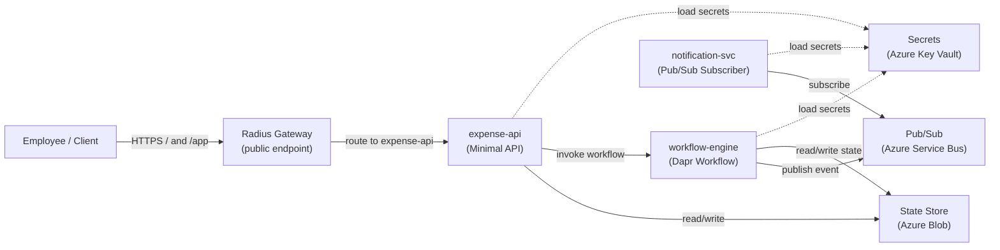

# RadiusClaim

> A reference sample for building portable distributed systems with **Dapr** (app layer) and **Radius** (infrastructure/environment layer), **deployed on Kubernetes with Azure backing services**.

---

> **Note:** This is sample code for learning and reference. It is not production-ready. Use it to understand patterns; adapt it for your production requirements, security posture, and testing standards.

---

## The Problem

Teams building distributed apps face two hard questions:

1. **How do I write app code once** but run it anywhere — local dev, staging, production — without rewriting for each platform?
2. **How do I define connections** (state stores, message buses, secrets) **cleanly**, without littering my app code or wrestling with raw Kubernetes YAML?

RadiusClaim shows the answer: **Dapr keeps app code portable; Radius declares what the app connects to and where services run.**

---

## The Architecture Story

### The Application Flow

An employee submits an expense. A workflow validates, approves or rejects, processes reimbursement, and notifies the employee — all orchestrated through loosely coupled services.

```
Employee
   │
   ├─> expense-api: POST /expenses
   │          │
   │          └─> [State] submit expense, invoke workflow-engine
   │
   ├─> workflow-engine: Dapr Workflow orchestrator
   │          │
   │          ├─> Activity: ValidateExpense
   │          ├─> Activity: ApproveExpense (auto-approve when amount is < $100.00)
   │          ├─> Activity: ProcessReimbursement
   │          └─> Publish: ExpenseApproved or ExpenseRejected to pub/sub
   │
   └─> notification-svc: Pub/Sub subscriber
              │
              └─> Log or send notification (email/Slack/console)
```

### The Service Boundaries

| Service | Responsibility | Dapr Building Blocks |
|---------|---------------|---------------------|
| **expense-api** | Accept submissions, expose query endpoints | Service Invocation, State |
| **workflow-engine** | Orchestrate the approval flow | Workflows, Pub/Sub (publisher) |
| **notification-svc** | Consume approval events, send notifications | Pub/Sub (subscriber) |

### Demo web UI

The sample now includes a lightweight web UI hosted by `expense-api` at **`/app`**.

- Submit expenses without leaving the browser
- Watch recent expense history update live
- Inspect workflow telemetry and correlation IDs without adding a separate frontend deployment surface
- Reach it through the Radius-managed public gateway on the Kubernetes deployment path

This keeps the demo teachable: no extra Node-based toolchain, no CORS setup, and no new platform story to explain before the core Radius + Dapr narrative lands.

> `/app` can load before the full backend is ready. For local runs, start `expense-api` with its Dapr sidecar and the configured `statestore`; workflow telemetry also needs `workflow-engine` reachable through Dapr. A plain `dotnet run` only brings up the ASP.NET shell.

### Dapr's Role: Portability

The **app code** uses Dapr abstractions:

- **State Store**: expenses and workflow checkpoints are persisted via Dapr, not SQL
- **Workflows**: distributed saga pattern via Dapr Workflow SDK
- **Pub/Sub**: loose coupling between workflow and notifications
- **Service Invocation**: expense-api talks to workflow-engine via Dapr, not raw HTTP

All of this is **cloud-agnostic**. The same `.NET` code runs:

- Locally with Redis (dev)
- On Kubernetes with any Dapr backing services (e.g., AKS with Azure Blob + Service Bus)
- On any Kubernetes cluster with pluggable components

### Radius's Role: Infrastructure Clarity

The **platform engineer** uses Radius to:

- Define **what services exist** (`expense-api`, `workflow-engine`, `notification-svc`)
- Wire **what they connect to** (state store, pub/sub, secrets) via links
- Choose **where they run** without rewriting the app model
- Separate **environment concerns** (`dev.bicep`, `azure-radius.bicep`)

Radius generates the Kubernetes manifests and Dapr component specs — no hand-written YAML.

### Deployment Story: Kubernetes-First with Portable Backing Services

**This sample is deployable on any Kubernetes cluster with Dapr and Radius.** The primary example uses **Azure Kubernetes Service (AKS)** with Azure-managed backing services.

**Primary deployment path** (`.github/workflows/deploy-azure.yml`, `deploy-kubernetes` job):
- Builds and publishes images, then runs `rad deploy` against `infra/radius/environments/azure-radius.bicep` and `infra/radius/app.bicep`
- Publishes the repo's custom Radius recipes as OCI artifacts before environment deployment, because Radius recipe `templatePath` values must resolve to registry-backed artifacts rather than local file paths
- Keeps service topology, Dapr component names, and resource wiring in Radius
- Deploys to a Kubernetes cluster (AKS in the Azure example, or any K8s cluster with Radius control plane)
- Exposes only `expense-api` publicly through an `Applications.Core/gateways@2023-10-01-preview` resource; `workflow-engine` and `notification-svc` stay internal
- Lets Radius print the public endpoint at deploy time, so humans can open `/app` without falling back to port-forward unless the cluster lacks an external address
- Azure-specific backing services (Blob Storage, Service Bus, Key Vault) are provisioned by Radius recipes for the Azure environment

**Stock Radius 0.55 alignment:** This repo keeps the deployable application surface on `Applications.Core/applications@2023-10-01-preview`, `Applications.Core/environments@2023-10-01-preview`, `Applications.Core/containers@2023-10-01-preview`, and `Applications.Core/gateways@2023-10-01-preview`, while the Dapr building blocks remain on [`Applications.Dapr/stateStores@2023-10-01-preview`](https://docs.radapp.io/reference/resource-schema/dapr-schema/statestore), [`Applications.Dapr/pubSubBrokers@2023-10-01-preview`](https://docs.radapp.io/reference/resource-schema/dapr-schema/pubsub/), and [`Applications.Dapr/secretStores@2023-10-01-preview`](https://docs.radapp.io/reference/resource-schema/dapr-schema/secretstore). That matches the first-party 0.55 docs and avoids the live `InvalidResourceNamespace` failure reported for `Radius.Compute/containers`. If you later target a custom preview catalog, the exact compute/ingress pivot is `Applications.Core/containers` → `Radius.Compute/containers` and `Applications.Core/gateways` → `Radius.Compute/routes`, plus the accompanying schema move from `properties.container` to a `properties.containers` map and from an `extensions[]` array to `extensions.daprSidecar`.

**Idempotent deployment:** The GitHub Actions workflow creates or switches to the target environment name (`azure`) directly rather than using temporary bootstrap environments. This ensures deployments are repeatable: `rad deploy` on the environment Bicep updates the environment configuration in place, and subsequent application deployments work against a stable, well-known environment identity. Manual deployments follow the same pattern: `rad env create <name> || true` then `rad env switch <name>` before deploying the environment Bicep.

**Operator fast path:** Treat cluster prep and app deployment as two separate phases.

```bash
# First time on a cluster
./scripts/prepare-cluster.sh \
  --resource-group radiusclaim-rg \
  --aks-cluster-name radiusclaim-aks \
  --create-aks \
  --create-spn \
  --install-dapr \
  --install-radius \
  --yes

./scripts/bootstrap.sh --resource-group radiusclaim-rg --create-spn --yes

# Later deployments on the same prepared cluster
./scripts/bootstrap.sh --resource-group radiusclaim-rg --yes
```

> **Note on `--create-spn`:** This flag is required only when creating a fresh service principal for the first time. Both `prepare-cluster.sh` and `bootstrap.sh` support it. Use `--create-spn` on the first run of either script; subsequent deployments to the same cluster do not need the flag. If you have stale or expired Azure credentials in the cluster, adding `--create-spn` to `bootstrap.sh` will detect and replace them.

**Dapr components via two-phase bootstrap:** Radius recipes provision Azure resources (Storage, Service Bus, Key Vault) and track them as `outputResources`. `bootstrap.sh` then runs `apply-dapr-components-from-recipes.sh` as a second phase to parse those resource IDs and create the Kubernetes `components.dapr.io` CRDs that Dapr sidecars need. This two-phase approach is a current platform behaviour: Radius does not expose recipe outputs through its API, so CRD creation is handled in bootstrap rather than directly inside recipes. RBAC assignments and workload identity federation are declared in the recipe Bicep files and apply at deploy time.

**Azure credential registration (required):** Before deploying the Radius environment with Azure-backed recipes, register the Azure credential with the Radius control plane using an explicit auth mode such as `rad credential register azure sp --client-id "$AZURE_CLIENT_ID" --client-secret "$AZURE_CLIENT_SECRET" --tenant-id "$AZURE_TENANT_ID"` (or `rad credential register azure wi ...` when workload identity is configured). This step is critical — without it, recipe deployment fails with a missing `azure-azurecloud-default` secret error. The GitHub Actions workflow includes the service principal form automatically; manual deployments must run an explicit `sp` or `wi` registration. See [`docs/radius-validation-checklist.md`](./docs/radius-validation-checklist.md) for details.

**Verified deployment cycle (fresh cluster):**

This sequence has been tested end-to-end and reflects the actual working deployment path:

```bash
# Start fresh — remove any previous Radius objects, Azure resources, and cluster state
./scripts/teardown.sh --resource-group radiusclaim-rg --yes

# Provision the cluster (first time only; skip if cluster already has Dapr + Radius)
./scripts/prepare-cluster.sh \
  --resource-group radiusclaim-rg \
  --aks-cluster-name radiusclaim-aks \
  --create-aks \
  --create-spn \
  --install-dapr \
  --install-radius \
  --yes

# Deploy everything (recipes, environment, app, Dapr components, validation)
./scripts/bootstrap.sh --resource-group radiusclaim-rg --create-spn --yes

# Confirm all workloads are healthy
kubectl get pods -n radiusclaim-azure
# Expected: expense-api (2/2), workflow-engine (2/2), notification-svc (2/2) — all Running
kubectl get components.dapr.io -n radiusclaim-azure
# Expected: statestore, pubsub, platform-secrets — all present
```

**What "deployment succeeded" looks like:**

| Check | Command | Expected |
|-------|---------|----------|
| All pods running | `kubectl get pods -n radiusclaim-azure` | 3 deployments, each 2/2 Running |
| Dapr components loaded | `kubectl get components.dapr.io -n radiusclaim-azure` | statestore, pubsub, platform-secrets |
| No CrashLoopBackOff | `kubectl get pods -n radiusclaim-azure` | STATUS = Running |
| Radius system healthy | `kubectl get pods -n radius-system` | All Running |
| Dapr system healthy | `kubectl get pods -n dapr-system` | All Running |
| Smoke test passes | `./scripts/validate-deployment.sh <URL>` | ✅ $50 flow, ✅ $150 flow, ✅ boundary case |

**Known platform behaviours:**

- **Component projection gap:** Radius may report `Applications.Dapr/*` resources as Succeeded without creating Kubernetes `components.dapr.io` CRDs. `bootstrap.sh` compensates for this by running `apply-dapr-components-from-recipes.sh` in Phase 2. If you deploy manually via `rad deploy` only, run this script separately (see Step 9a in `docs/end-to-end-setup-walkthrough.md`).
- **Recipe outputs not exposed:** Radius does not expose recipe Bicep outputs through its API. The two-phase workaround parses Azure resource IDs from `status.outputResources[]` instead. This is opaque from the app side.
- **Public gateway readiness lag:** The Radius gateway may not be immediately reachable after bootstrap. `validate-deployment.sh` falls back to port-forward if the public URL is unavailable.
- **Auth mode by context:** Local bootstrap uses workload identity by default; Azure Policy on this tenant blocks shared keys. The CI workflow (`deploy-azure.yml`) uses service principal registration with `AZURE_CLIENT_SECRET` because OIDC-federated GitHub Actions tokens are not yet wired to the Radius credential.

**Supported deployment targets**:
- **AKS (Azure Kubernetes Service)** — the primary example, with Azure backing services
- **Arc-enabled Kubernetes** — on-premises or multi-cloud Kubernetes with Radius and Azure recipes
- **Self-managed Kubernetes clusters** — any K8s cluster with Dapr and Radius control plane; Azure backing services require Azure subscription

**Portability scope**:
1. **Application code is fully portable** — uses Dapr abstractions (state, pub/sub, service invocation, workflows)
2. **Deployment model is portable** — Radius app model and environment patterns are cloud-agnostic
3. **Azure backing services are Azure-specific** — Blob Storage, Service Bus, Key Vault recipes require Azure
4. When Radius recipes for other clouds are added, the same app model can target those platforms with only environment/recipe changes

---

## Radius Environments: The Portability Story

RadiusClaim includes three Radius environments under `infra/radius/environments/`, demonstrating how the same application code adapts to different backing service implementations without any code changes.

### **`azure-radius.bicep` — Production Environment**
- **Compute:** Kubernetes cluster
- **Backing Services:** Azure managed services provisioned via Radius Recipes
  - State Store → Azure Blob Storage (RBAC + workload identity)
  - Pub/Sub → Azure Service Bus (federated auth, no shared keys)
  - Secrets → Azure Key Vault (Secrets User role)
- **Use case:** Production deployments on AKS with real Azure backing
- **Deploy:**
  ```bash
  rad deploy infra/radius/environments/azure-radius.bicep \
    --parameters "@infra/radius/environments/azure-radius.parameters.json" \
    --parameters azureSubscriptionId=<sub-id> \
    --parameters azureResourceGroup=<rg-name>
  ```

### **`local.bicep` — Local Development Environment**
- **Compute:** Kubernetes cluster (same cluster as production)
- **Backing Services:** In-cluster only, no Azure dependency
  - State Store → Redis (deployed via Recipe)
  - Pub/Sub → RabbitMQ (deployed via Recipe)
  - Secrets → Kubernetes secrets (deployed via Recipe)
- **Use case:** Local development, testing portability, air-gapped deployments
- **Key difference:** No Azure provider block; recipes must deploy services entirely in-cluster
- **Deploy:**
  ```bash
  rad deploy infra/radius/environments/local.bicep
  ```

### **`dev.bicep` — Development Environment**
- **Compute:** Kubernetes cluster
- **Backing Services:** Azure-backed recipes (same as production)
- **Use case:** Development iteration with production-equivalent backing services
- **Key insight:** Developers use real Azure resources during development, catching integration issues early
- **Deploy:**
  ```bash
  rad deploy infra/radius/environments/dev.bicep \
    --parameters azureSubscriptionId=<sub-id> \
    --parameters azureResourceGroup=<rg-name>
  ```

### **The Key Pattern: Same App, Different Environments**
The application definition in `app.bicep` is **identical** across all three environments. It declares:
- Three workloads (expense-api, workflow-engine, notification-svc)
- Dapr components by **default** name (not environment-specific)
- No hardcoded environment knowledge

Each environment's Bicep file wires Dapr component recipes to match that environment's backing services. When you deploy the app, it uses the recipes from the active Radius environment:

```bicep
// In app.bicep — same across all environments
resource statestore 'Applications.Dapr/stateStores@2023-10-01-preview' = {
  name: 'statestore'
  properties: {
    environment: environment
    application: app.name
    type: 'state.azure.blobstorage'  // Dapr building block type
  }
}

// In azure-radius.bicep — the Recipe that backs state.azure.blobstorage
recipes: {
  'Applications.Dapr/stateStores': {
    default: {
      templateKind: 'bicep'
      templatePath: '${recipeRegistry}/state-store:${recipeTag}'
    }
  }
}

// In local.bicep — a different Recipe for the same Dapr building block
recipes: {
  'Applications.Dapr/stateStores': {
    default: {
      templateKind: 'bicep'
      templatePath: '${recipeRegistry}/local/state-store:${recipeTag}'
    }
  }
}
```

### **Recipes as OCI Artifacts**
Radius recipes are published as OCI artifacts to a container registry (GHCR in this case):
- **Path:** `ghcr.io/wesback/radiusclaim/recipes/state-store:latest`
- **Versioning:** Pin to a specific tag (SHA or semver) for reproducible deploys
- **Security:** Use workload identity + RBAC; no shared keys in Recipes
- **Publishing:** `rad bicep publish` automatically versions and pushes Recipe Bicep modules

This approach enables:
1. **Reusable recipes** — the same Recipe artifact can be used across multiple Radius installations
2. **Environment-specific customization** — each environment can point to different recipe registries or versions
3. **CI/CD integration** — build pipelines can tag and version recipes, and deployments can pin to specific versions

---

## How Portability Works: Radius Owns Wiring

**The core paradigm:** Radius recipes are fully responsible for infrastructure wiring — RBAC assignments, Component CRD creation, and workload identity federation. The application code stays portable across environments because it declares *what* it needs (Dapr building blocks) without prescribing *how* or *where* those needs are satisfied.

### Wiring Responsibilities in Recipes

When a Radius recipe provisions a backing service (e.g., `state-store.bicep`), it:

1. **Creates the Azure resource** (e.g., Storage Account, Service Bus, Key Vault)
2. **Assigns RBAC roles** so the workload identity can access the resource
3. **Creates the Dapr Component CRD** so the Dapr sidecar can discover and use the resource
4. **Sets up workload identity federation** (in the environment Bicep) so pods can authenticate without shared secrets

**Before Phase 3 (old paradigm):** Recipes provisioned Azure resources, then separate bootstrap scripts had to:
- Query Azure by naming patterns
- Manually create Dapr Component CRDs
- Apply RBAC workarounds if recipes didn't handle them
- Patch service accounts with identity annotations

**Result:** App portability was brittle — bootstrap scripts had to "know" what recipes did, coupling infrastructure to deployment orchestration.

**After Phase 3 (new paradigm):** Recipes declare everything needed.

```bicep
// In state-store.bicep: full wiring
resource stateComponent 'dapr.io/Component@v1alpha1' = {
  metadata: {
    name: 'statestore'
    namespace: kubernetesNamespace
  }
  spec: {
    type: 'state.azure.blobstorage'
    version: 'v2'
    metadata: [
      { name: 'accountName', value: storageAccount.name }
      { name: 'containerName', value: containerName }
      { name: 'azureClientId', value: daprClientId }
      { name: 'azureTenantId', value: daprTenantId }
    ]
  }
  dependsOn: [storageAccount, roleAssignment]
}
```

**Result:** App code travels with recipes. RBAC and workload identity federation are inline in Bicep, not in bootstrap scripts. The remaining orchestration step (Dapr CRD creation from `outputResources`) is automated in `bootstrap.sh` as Phase 2.

### Workload Identity: From Bootstrap to Bicep

Workload identity (federated credentials + role assignments) is now **entirely in Bicep**, not bootstrap:

- **`infra/azure/workload-identity.bicep`** — Creates the managed identity and federated credentials (before Radius deploy)
- **Radius environment Bicep** — Passes identity IDs to recipes as parameters
- **Recipes** — Use those IDs in Component metadata and RBAC assignments

### Bootstrap: Two-Phase Orchestration

`scripts/bootstrap.sh` handles what must be orchestrated sequentially:

**Phase 1 — Infrastructure and app deployment:**
1. Enable AKS OIDC + workload identity addon
2. Deploy `workload-identity.bicep` to create the managed identity
3. Deploy Radius environment (recipes provision Azure resources and assign RBAC)
4. Deploy application workloads

**Phase 2 — Dapr component wiring:**
5. Run `apply-dapr-components-from-recipes.sh` to parse Azure resource IDs from Radius `outputResources` and create Kubernetes `components.dapr.io` CRDs
6. Annotate service accounts with workload identity client ID
7. Restart workloads so Dapr sidecars load the components

**Phase 3 — Validation:**
8. Run end-to-end smoke test against the deployed app

**What bootstrap does not do:**
- ❌ Query Azure by name pattern to find resources
- ❌ Apply RBAC workarounds outside of recipe Bicep
- ❌ Manage environment state or Radius workspace beyond idempotent setup

---

**Legacy ACA reference only:**
The old ACA fallback path has been removed from the GitHub Actions workflow. `infra/radius/environments/azure.bicep` remains only as a legacy Azure Container Apps reference; the active workflow is Kubernetes-first. Teams requiring container-only Azure deployment should use Azure Container Instances or Azure Container Apps directly outside this sample.

---

## Deployment Assumptions

This section clarifies implicit conventions in the Radius environment and recipe structure, so operators understand how namespace derivation, component naming, and Dapr integration work without reverse-engineering bash scripts.

### Workload Namespace Pattern

All workloads and Dapr components are placed in the **same Kubernetes namespace**, which is derived from the Radius environment's `kubernetesNamespace` parameter.

**Pattern:**
```
kubernetesNamespace = {environment}
```

**Example:**
- Environment: `radiusclaim-azure`
- Kubernetes Namespace: `radiusclaim-azure`
- Dapr components created: `statestore`, `pubsub`, `platform-secrets`
- All components are projected into the `radiusclaim-azure` namespace by Radius

**Why this matters:**
- Radius creates the namespace if it doesn't exist
- Dapr sidecars in workload pods auto-discover components in the same namespace
- Multi-tenancy: different environments (e.g., `dev` vs `prod`) use different namespaces and can coexist on the same cluster

### Recipe Naming Convention

Radius recipes follow a consistent naming pattern for simplicity and quick visual identification:

| Recipe Type | Naming Convention | Example | Azure Resource |
|-------------|-------------------|---------|-----------------|
| **State Store** | `staterc{randomSuffix}` | `staterc1a2b3c` | Azure Blob Storage Account |
| **Pub/Sub Broker** | `pubsubrc{randomSuffix}` | `pubsubrc4d5e6f` | Azure Service Bus Namespace |
| **Secret Store** | `kvrc{randomSuffix}` | `kvrc7g8h9i` | Azure Key Vault |

**Derivation:**
- `staterc` = **state** **r**ecipe
- `pubsubrc` = **pub/sub** **r**ecipe
- `kvrc` = **Key Vault** **r**ecipe
- `{randomSuffix}` = 6-character hash (from `randomNameSuffix` parameter or `uniqueString(context.resource.id)`)

**Why this pattern:**
- Quickly identifies what each resource does
- Keeps names short (Azure storage account names are 3–24 characters)
- Deterministic naming (`uniqueString`) ensures idempotent deployments when `randomNameSuffix` is empty
- Random suffix (dev/demo) prevents name collisions across multiple deployments

### How Dapr Components Are Wired to Recipes

**Deployment flow:**

1. **Environment deployment** (`azure-radius.bicep`)
   - Registers three Dapr recipes: `azure-postgres-statestore`, `azure-servicebus-pubsub`, `azure-keyvault-secrets`
   - These recipes are scoped to the Radius environment and reference OCI-published Bicep modules

2. **Application deployment** (`app.bicep`)
   - Defines three Dapr component connections: `statestore`, `pubsub`, `platform-secrets`
   - Each references a recipe by name (e.g., `recipe: { name: 'azure-postgres-statestore' }`)
   - Radius provisions the backing Azure resources and creates Dapr component CRDs in Kubernetes

3. **Component projection** (automatic)
   - Radius projects each Dapr component CRD into the target namespace
   - Dapr sidecars in workload pods discover these components by name
   - Workload code references components by name using Dapr client libraries

**Verification:**
```bash
# List Dapr components in the workload namespace
kubectl get components.dapr.io -n radiusclaim-azure

# Expected output:
# NAME                           AGE
# platform-secrets               2m
# pubsub                         2m
# statestore                     2m

# Inspect component details (e.g., backing Azure Key Vault metadata)
kubectl describe component platform-secrets -n radiusclaim-azure
```

### How Workloads Access Dapr Components

Workloads don't require explicit credentials or configuration — Dapr sidecars handle all authentication.

**Flow:**

1. **Dapr sidecar initialization**
   - Sidecar loads the component CRD from Kubernetes (e.g., `statestore`)
   - Sidecar reads component metadata (storage account name, service bus endpoint, etc.)
   - Sidecar authenticates to the backing Azure resource using **Microsoft Entra workload identity**

2. **Workload code**
   - Uses Dapr client libraries (e.g., `DaprClient` in .NET)
   - Calls Dapr abstractions (e.g., `SaveStateAsync("statestore", ...)`)
   - No hardcoded connection strings or credentials in app code

3. **Authentication flow**
   - Workload pod label: `azure.workload.identity/use: "true"`
   - Kubernetes service account: annotated with federated credential
   - Dapr sidecar: exchanges service account token for Azure access token (OIDC)
   - Dapr uses access token to authenticate to Azure services (RBAC)

**Key security properties:**
- No secrets in Kubernetes (no connection strings, storage keys, or API tokens)
- No shared keys (RBAC only)
- Short-lived tokens (Azure OIDC federation)
- Audit trail in Azure Activity Log

### Secrets and Configuration

**Where secrets live:**
- **Runtime secrets:** Azure Key Vault (accessed via Dapr `platform-secrets` component)
- **Configuration:** Kubernetes ConfigMaps (can be injected as environment variables)
- **Credentials for Radius provisioning:** Azure service principal (stored outside the cluster)

**Dapr secret store integration:**
- App code calls `client.GetSecretAsync("platform-secrets", "secret-name")`
- Dapr routes the request to the Azure Key Vault component
- Sidecar authenticates to Key Vault using workload identity
- Secret is returned to the app without ever being stored in Kubernetes

**Example:**
```csharp
var secretsClient = new SecretClient(
    vaultUri: new Uri("https://kvrc1a2b3c.vault.azure.net/"),
    credential: new DefaultAzureCredential()
);

var secret = await daprClient.GetSecretAsync(
    storeName: "platform-secrets",
    key: "api-key"
);

var apiKey = secret["api-key"];  // Retrieved from Azure Key Vault
```

---

## Architecture Diagram (Mermaid)



---

## Project Layout

```
RadiusClaim/
├── src/
│   ├── RadiusClaim.Contracts/           # Shared DTOs and events
│   ├── expense-api/                      # Minimal API for submission + hosted web UI
│   ├── workflow-engine/                  # Dapr Workflow orchestrator
│   └── notification-svc/                 # Pub/Sub subscriber
├── infra/
│   ├── radius/
│   │   ├── app.bicep                     # Radius application model
│   │   ├── environments/
│   │   │   ├── azure-radius.bicep        # Production: Kubernetes + Azure Recipes
│   │   │   ├── azure-radius.parameters.json
│   │   │   ├── local.bicep               # Development: Kubernetes + in-cluster Recipes
│   │   │   └── dev.bicep                 # Dev: Kubernetes + Azure Recipes
│   │   └── recipes/azure/
│   │       ├── state-store.bicep         # Azure Blob Storage recipe
│   │       ├── pubsub.bicep              # Azure Service Bus recipe
│   │       └── secrets.bicep             # Azure Key Vault recipe
│   └── dapr/local/                       # Local-only Dapr component overlays
├── scripts/
│   ├── prepare-cluster.sh                # First-time AKS/Kubernetes cluster preparation
│   ├── bootstrap.sh                      # Repeatable orchestration: Radius deployment + validation
│   ├── publish-radius-recipes.sh          # OCI recipe publishing
│   └── validate-deployment.sh             # End-to-end flow validation
├── RadiusClaim.slnx
└── README.md
```

---

## Shared Contracts

All services use these types from `RadiusClaim.Contracts`. No Dapr dependencies in contracts — pure data shapes.

### Demo flow contract rules

- `ExpenseId` is the stable business identifier for the expense record.
- `CorrelationId` is created at submission time and reused across workflow and notification messages; in later phases it can double as the workflow instance id.
- Timestamp fields are explicitly named with `Utc` so the demo does not imply local-time behavior.
- `ExpenseRejected` is reserved for a terminal denial with a required human-readable reason.
- `NotificationRequest.EventType` keeps notification semantics explicit and leaves room for a future `ManualReviewRequested` branch without overloading rejection.

### Current contract shapes

```csharp
public sealed record ExpenseSubmission(
    string ExpenseId,
    string CorrelationId,
    string EmployeeId,
    decimal Amount,
    string Currency,
    string Description,
    DateTimeOffset SubmittedAtUtc
);

public sealed record ExpenseApproved(
    string ExpenseId,
    string CorrelationId,
    string EmployeeId,
    decimal ApprovedAmount,
    string Currency,
    string DecisionSource,
    DateTimeOffset ApprovedAtUtc
);

public sealed record ExpenseRejected(
    string ExpenseId,
    string CorrelationId,
    string EmployeeId,
    decimal Amount,
    string Currency,
    string DecisionSource,
    string Reason,
    DateTimeOffset RejectedAtUtc
);

public enum NotificationEventType
{
    ExpenseApproved,
    ExpenseRejected,
    ManualReviewRequested
}

public sealed record NotificationRequest(
    string ExpenseId,
    string CorrelationId,
    string Recipient,
    string Channel,
    NotificationEventType EventType,
    string Subject,
    string Message,
    DateTimeOffset OccurredAtUtc
);
```

### Threshold rule for the sample

- **Invalid input:** amounts less than or equal to `0` are validation failures, not approval outcomes.
- **Auto-approval:** an amount strictly below **`$100.00`** is eligible for automatic approval.
- **Boundary decision:** **`$100.00` exactly is _not_ auto-approved.**
- **Future manual-review path:** amounts at or above **`$100.00`** will later produce a distinct `ManualReviewRequested` event/notification path. That path is intentionally **not** represented as `ExpenseRejected`, because “needs a human decision” is not the same thing as “denied.”

---

## Why This Architecture?

### Simplicity for a Ten-Minute Demo

- **Three services** = enough to show service invocation, workflows, pub/sub, and state
- **One workflow** = concrete orchestration pattern, not abstract theory
- **Shared contracts** = no coupling on schema, only on types
- **No authentication, audit logging, or multi-tier approval** = focus on the core pattern

### Enterprise-Ready Story

- **Portability**: App code is Dapr-native but not cloud-specific; same code runs anywhere
- **Clarity**: Dapr is the "app language" (state, workflows, pub/sub); Radius is the "platform language" (services, links, environments)
- **Testability**: Contracts are plain C#; services are standalone; integration tests work locally with Dapr emulators

### Application Portability vs. Infrastructure Reality

**Application code is cloud-agnostic:**

| Concern | Dev (Local) | Production (Any Dapr Platform) |
|---------|-------------|--------------------------------|
| Compute | Docker Dapr sidecar | Any container runtime with Dapr |
| State Store | Redis (via Dapr) | Any Dapr state component |
| Pub/Sub | Redis (via Dapr) | Any Dapr pub/sub component |
| Secrets | Local file (via Dapr) | Any Dapr secret store |

**Current infrastructure path is Kubernetes-first with Azure backing services:**

The provided GitHub Actions workflow deploys to Kubernetes (AKS as the primary example) with Dapr and Radius. The app code remains portable. When Radius recipes for other clouds are available, the same app model can target those platforms. Azure backing services (Blob Storage, Service Bus, Key Vault) are Azure-specific because Radius recipes define them that way — other recipe implementations can substitute equivalent services on other clouds or use self-managed options.

---

## Deployment: Kubernetes-First with Azure Example

The GitHub Actions workflow (`.github/workflows/deploy-azure.yml`) deploys to Kubernetes (AKS as the primary example) via Radius.

### Required Repository Secrets

| Secret | Purpose | Required |
|--------|---------|----------|
| `AZURE_SUBSCRIPTION_ID` | Azure subscription ID for Azure backing services (state, pub/sub, secrets recipes) | ✅ Yes |
| `AZURE_CLIENT_ID` | Azure service principal client ID used when registering Radius Azure credentials in CI | ✅ Yes |
| `AZURE_CLIENT_SECRET` | Azure service principal client secret — used in CI (`deploy-azure.yml`) to register Radius Azure credentials via `rad credential register azure sp`. Not used when running bootstrap locally with workload identity (`--azure-auth-mode wi` or the default `auto` mode). | ✅ Yes (CI); optional (local WI path) |
| `AZURE_TENANT_ID` | Azure tenant ID used when registering Radius Azure credentials in CI | ✅ Yes |
| `RADIUS_KUBECONFIG` | Raw kubeconfig content for the Kubernetes cluster that hosts Radius and the app workloads | ✅ Yes |
| `GHCR_TOKEN` | GitHub personal access token with `read:packages` scope -- used by `prepare-cluster.sh` to create the `ghcr-pull-secret` image pull secret so AKS can pull images from `ghcr.io/wesback` | ✅ Yes (for `prepare-cluster.sh`) |

### Required Repository Variables

| Variable | Purpose | Example |
|----------|---------|---------|
| `AZURE_LOCATION` | Azure region for backing services (Blob, Service Bus, Key Vault) | `eastus`, `westus2` |
| `AZURE_RESOURCE_GROUP` | Resource group name for Azure backing services | `radiusclaim-rg` |
| `RADIUS_KUBERNETES_CONTEXT` | kubectl context name (optional, uses current context if unset) | `my-aks-context` |
| `RADIUS_KUBERNETES_NAMESPACE` | Target Kubernetes namespace (optional, defaults to `radiusclaim-azure`) | `radiusclaim-azure` |

**To configure secrets and variables:**
1. Navigate to your repository **Settings** → **Secrets and variables** → **Actions**
2. Add secrets under the **Secrets** tab
3. Add variables under the **Variables** tab
4. Start with the [end-to-end setup walkthrough](./docs/end-to-end-setup-walkthrough.md) for the full operator flow, then use the [Kubernetes + Radius validation checklist](./docs/radius-validation-checklist.md) for preflight checks and troubleshooting

**Create the service principal (one-time):**

Scope it to the target resource group instead of the whole subscription.

```bash
export AZURE_RESOURCE_GROUP="radiusclaim-rg"
export AZURE_SUBSCRIPTION_ID="$(az account show --query id -o tsv)"

az ad sp create-for-rbac \
  --name "radiusclaim-github-actions" \
  --role Contributor \
  --scopes "/subscriptions/$AZURE_SUBSCRIPTION_ID/resourceGroups/$AZURE_RESOURCE_GROUP" \
  --query '{clientId:appId,clientSecret:password,tenantId:tenant}' \
  -o jsonc
```

Store the returned `clientId`, `clientSecret`, and `tenantId` as GitHub secrets named `AZURE_CLIENT_ID`, `AZURE_CLIENT_SECRET`, and `AZURE_TENANT_ID`, and store `AZURE_SUBSCRIPTION_ID` as a GitHub secret too.

### Deployment Path: Kubernetes + Radius

- First-time cluster prep lives in `scripts/prepare-cluster.sh` (AKS reuse/create, `kubectl` context, Dapr, Radius, Radius workspace/group)
- Builds service images and pushes to GHCR (GitHub Container Registry)
- Manual `rad deploy` runs must pass a real published image tag; the stale `phase1` fallback was removed so the app model stops pointing at retired GHCR packages
- `scripts/bootstrap.sh` orchestrates the repeatable deployment layer: Radius environment (`azure-radius.bicep`), application (`app.bicep`), and validation
- Azure backing resources (Blob Storage, Service Bus, Key Vault) are created by Radius recipes
- Publishes `expense-api` through a Radius-managed public gateway while keeping the worker services internal
- Uses the shared end-to-end validation script; CI still uses a Kubernetes port-forward as deterministic fallback while the public endpoint propagates
- **Requires:** `RADIUS_KUBECONFIG` secret, Kubernetes cluster with Dapr and Radius control plane

**Supported targets:**
- Azure Kubernetes Service (AKS) with Azure backing services (primary example)
- Arc-enabled Kubernetes clusters with Radius and Azure recipes
- Self-managed Kubernetes + Radius with Azure recipes
- Self-managed Kubernetes + Radius with custom recipes (backings remain local or cloud-specific based on recipe choice)

### Using a Private Container Registry

The three service images (`expense-api`, `workflow-engine`, `notification-svc`) are **public on GHCR by default**. This is intentional: RadiusClaim is a reference sample designed for zero-friction demos and learning. Every engineer who clones the repo can `rad deploy` without credential ceremony — focus stays on Dapr + Radius, not registry authentication.

Teams taking this to production with private images have a clear escape hatch:

**Step 1 — Make your GHCR packages private** (via GitHub UI or API)

**Step 2 — Create a pull secret in your Kubernetes namespace:**

```bash
kubectl create secret docker-registry ghcr-pull-secret \
  --docker-server=ghcr.io \
  --docker-username=YOUR_GITHUB_USERNAME \
  --docker-password=YOUR_GHCR_PAT \
  -n YOUR_NAMESPACE
```

Your PAT must have `read:packages` scope.

**Step 3 — Pass `ghcrImagePullRef` when deploying:**

```bash
rad deploy infra/radius/app.bicep \
  --parameters imageTag=$(git rev-parse --short HEAD) \
  --parameters ghcrImagePullRef='ghcr-pull-secret'
```

**Step 4 — For `bootstrap.sh` users, set `GHCR_PACKAGES_PRIVATE=true`:**

```bash
GHCR_PACKAGES_PRIVATE=true ./scripts/bootstrap.sh \
  --resource-group radiusclaim-rg \
  --yes
```

**Note:** The CI workflow (`deploy-azure.yml`) already defensively creates `ghcr-pull-secret` on every run using the GitHub Actions token — no extra configuration is needed for private packages in CI. If your images are private, the workflow will use the secret automatically.

---

## Scaling: Expense Index Boundary

RadiusClaim stores active expense IDs in a single Dapr state entry (`expenseIndex`), which is perfectly fine for demos and small deployments but has a practical limit as the number of expenses grows.

**Quick answer:** The sample scales comfortably to **10,000–50,000 active expenses** with the current architecture. Beyond that, latency increases, Dapr sidecars experience memory pressure, and Blob Storage throughput becomes a constraint.

**Why it happens:**
- Every list request reads the entire `expenseIndex` array from Blob Storage
- Dapr workflow history also accumulates in the state store
- Blob Storage latency increases with object size

**How to know when you're hitting it:**
- GET /expenses starts taking >1 second
- Dapr sidecar pods are OOMKilled or use >300 MB memory
- Workflow execution times increase
- Azure Monitor shows Blob Storage latency climbing above 200ms

**What to do about it:**
- **Short term:** Archive old expenses; add caching
- **Medium term:** Shard the index by employee or month
- **Long term:** Switch to a query-capable store like Cosmos DB

See **[`docs/SCALING.md`](./docs/SCALING.md)** for a complete breakdown of the boundary, diagnostics, and five proven mitigation strategies.

---

## Quick Start (Local Dev)

For local development without Kubernetes, use the Docker Compose + Dapr path:

```bash
# Start Redis (state store + pub/sub backing) and supporting infrastructure
docker compose -f infra/dapr/local/docker-compose.yaml up -d

# Run workflow-engine with Dapr sidecar
dapr run --app-id workflow-engine --app-port 5299 --resources-path ./infra/dapr/local -- \
  dotnet run --project src/workflow-engine/WorkflowEngine.csproj

# Run expense-api with Dapr sidecar (separate terminal)
dapr run --app-id expense-api --app-port 5062 --resources-path ./infra/dapr/local -- \
  dotnet run --project src/expense-api/ExpenseApi.csproj
```

Then open `http://localhost:5062/app`. See [`docs/local-dev.md`](./docs/local-dev.md) for the full local development walkthrough.

---

## Portability Validation

To verify the codebase adheres to the portability paradigm (Dapr abstractions, parameterized infrastructure, idempotent deployment):

```bash
bash tests/portability/run-all.sh
```

This runs automated checks that validate:

- **App code portability** — No hardcoded Azure subscriptions, regions, or direct SDK usage
- **Recipe self-containment** — Radius recipes are complete and deployable standalone
- **Bootstrap idempotency** — Deployment scripts can be re-run safely
- **Region-agnostic deployment** — Moving regions requires only parameter changes
- **Dapr component availability** — Required components exist in cluster namespace

See **[tests/portability/README.md](./tests/portability/README.md)** for detailed test descriptions and individual test execution.

---

## What's Next

**Completed:**
1. ✅ **Phase 1–4**: App code complete (Dapr workflows, pub/sub, state, service invocation)
2. ✅ **Phase 5**: Radius models and local validation
3. ✅ **Phase 6**: GitHub Actions CI/CD, Kubernetes-first deployment path, and end-to-end validation

**In Progress:**
7. **Phase 7**: Final documentation, extended demo walkthrough, and integration test harness

**Future Enhancements (Out of Scope):**
- Radius recipes for other clouds — would enable same app model on other platforms
- Multi-environment promotion (dev → staging → prod)
- Real notification output bindings (email, Slack, Teams)
- Integration test suite
- Secret rotation patterns

---

## Additional Documentation

- **[End-to-End Setup Walkthrough](./docs/end-to-end-setup-walkthrough.md)** — Complete operator guide from Azure login and resource group creation through opening the app in a browser, including setup automation vs. manual steps
- **[Phase 7 Demo Walkthrough](./docs/phase-7-demo-walkthrough.md)** — Step-by-step guide for running the $50 and $150 expense flows
- **[Kubernetes + Radius Validation Checklist](./docs/radius-validation-checklist.md)** — Pre-deployment validation and troubleshooting for Kubernetes + Radius deployment
- **[ADR-0001: Kubernetes-First Deployment Strategy](./docs/ADR-0001-kubernetes-first-deployment.md)** — Architectural decision record explaining the Kubernetes + Radius primary path and portability scope

---

## Links

- [Dapr Docs](https://docs.dapr.io)
- [Radius Docs](https://docs.radapp.io)
- [Azure Kubernetes Service](https://learn.microsoft.com/en-us/azure/aks)

---

**Status:** End-to-end deployment validated ✅ (fresh-cluster teardown → prepare → bootstrap → validate cycle confirmed; all workloads healthy, Dapr components connected, Azure backing services deployed)  
**Target:** Dapr-portable app code; Kubernetes + Radius declarative deployment; Azure backing services (other clouds supported via recipes)  
**Demo Runtime:** ~10 minutes (proof: auto-approve flow at < $100, manual review at ≥ $100, end-to-end pub/sub notification)
