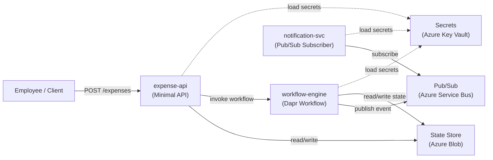

# RadiusClaim

> A reference sample for building portable distributed systems with **Dapr** (app layer) and **Radius** (infrastructure/environment layer), **deployed on Azure Container Apps**.

---

## The Problem

Teams building distributed apps face two hard questions:

1. **How do I write app code once** but run it anywhere — local dev, staging, production — without rewriting for each platform?
2. **How do I define connections** (state stores, message buses, secrets) **cleanly**, without littering my app code or wrestling with raw Kubernetes YAML?

RadiusClaim shows the answer: **Dapr keeps app code portable; Radius declares what the app connects to and where services run.**

---

## The Architecture Story

### The Application Flow

An employee submits an expense. A workflow validates, approves or rejects, processes reimbursement, and notifies the employee — all orchestrated through loosely coupled services.

```
Employee
   │
   ├─> expense-api: POST /expenses
   │          │
   │          └─> [State] submit expense, invoke workflow-engine
   │
   ├─> workflow-engine: Dapr Workflow orchestrator
   │          │
   │          ├─> Activity: ValidateExpense
   │          ├─> Activity: ApproveExpense (auto-approve when amount is < $100.00)
   │          ├─> Activity: ProcessReimbursement
   │          └─> Publish: ExpenseApproved or ExpenseRejected to pub/sub
   │
   └─> notification-svc: Pub/Sub subscriber
              │
              └─> Log or send notification (email/Slack/console)
```

### The Service Boundaries

| Service | Responsibility | Dapr Building Blocks |
|---------|---------------|---------------------|
| **expense-api** | Accept submissions, expose query endpoints | Service Invocation, State |
| **workflow-engine** | Orchestrate the approval flow | Workflows, Pub/Sub (publisher) |
| **notification-svc** | Consume approval events, send notifications | Pub/Sub (subscriber) |

### Dapr's Role: Portability

The **app code** uses Dapr abstractions:

- **State Store**: expenses and workflow checkpoints are persisted via Dapr, not SQL
- **Workflows**: distributed saga pattern via Dapr Workflow SDK
- **Pub/Sub**: loose coupling between workflow and notifications
- **Service Invocation**: expense-api talks to workflow-engine via Dapr, not raw HTTP

All of this is **cloud-agnostic**. The same `.NET` code runs:

- Locally with Redis (dev)
- On Azure Container Apps with Service Bus and Blob Storage (prod)
- On any Kubernetes cluster with pluggable components

### Radius's Role: Infrastructure Clarity

The **platform engineer** uses Radius to:

- Define **what services exist** (`expense-api`, `workflow-engine`, `notification-svc`)
- Wire **what they connect to** (state store, pub/sub, secrets) via links
- Choose **where they run** without rewriting the app model
- Separate **environment concerns** (`dev.bicep`, `azure-radius.bicep`, ACA fallback bootstrap)

Radius generates the Kubernetes manifests and Dapr component specs — no hand-written YAML.

### Deployment Story: Portable App, Radius-First Azure Example

**This sample is deployable on Azure today.** The app model is now the primary deployment contract; Azure-specific details sit behind environment and recipe choices.

**Primary deployment path** (`.github/workflows/deploy-azure.yml`, `deployment_mode=radius-first`):
- Builds and publishes images, then runs `rad deploy` against `infra/radius/environments/azure-radius.bicep` and `infra/radius/app.bicep`
- Keeps service topology, Dapr component names, and resource wiring in Radius
- Limits Azure-specific choices to the environment/provider scope and recipe implementations

**Secondary fallback** (`deployment_mode=aca-fallback`):
- Provisions Azure Container Apps and Azure-backed Dapr components with `az deployment group` + `az containerapp`
- Exists because Radius does **not** currently expose Azure Container Apps as a supported compute kind
- Is intentionally demoted to the Azure-specific escape hatch rather than the main story

**Portable story**:
1. App code uses Dapr abstractions (app layer)
2. Radius declares service topology and backing resources (platform layer)
3. `rad deploy` handles the primary deployment flow; Azure-specific bootstrap only remains where Radius lacks ACA parity

For now, **Azure is still the deployment example**. The Dapr-based application code remains portable, and the GitHub Actions workflow now tells that story directly: Radius first, ACA fallback second.

---

## Architecture Diagram (Mermaid)



---

## Project Layout

```
sovereignapp/
├── src/
│   ├── CloudExpense.Contracts/           # Shared DTOs and events
│   ├── expense-api/                      # Minimal API for submission
│   ├── workflow-engine/                  # Dapr Workflow orchestrator
│   └── notification-svc/                 # Pub/Sub subscriber
├── infra/
│   ├── radius/
│   │   ├── app.bicep                     # Radius application model
│   │   ├── environments/
│   │   │   ├── dev.bicep                 # Local Radius environment
│   │   │   ├── azure-radius.bicep        # Radius-first Azure-backed environment
│   │   │   └── azure.bicep               # ACA fallback bootstrap
│   │   └── recipes/azure/                # Azure backing-resource recipes
│   └── dapr/local/                       # Local-only Dapr component overlays
├── RadiusClaim.slnx
└── README.md
```

---

## Shared Contracts

All services use these types from `CloudExpense.Contracts`. No Dapr dependencies in contracts — pure data shapes.

### Demo flow contract rules

- `ExpenseId` is the stable business identifier for the expense record.
- `CorrelationId` is created at submission time and reused across workflow and notification messages; in later phases it can double as the workflow instance id.
- Timestamp fields are explicitly named with `Utc` so the demo does not imply local-time behavior.
- `ExpenseRejected` is reserved for a terminal denial with a required human-readable reason.
- `NotificationRequest.EventType` keeps notification semantics explicit and leaves room for a future `ManualReviewRequested` branch without overloading rejection.

### Current contract shapes

```csharp
public sealed record ExpenseSubmission(
    string ExpenseId,
    string CorrelationId,
    string EmployeeId,
    decimal Amount,
    string Currency,
    string Description,
    DateTimeOffset SubmittedAtUtc
);

public sealed record ExpenseApproved(
    string ExpenseId,
    string CorrelationId,
    string EmployeeId,
    decimal ApprovedAmount,
    string Currency,
    string DecisionSource,
    DateTimeOffset ApprovedAtUtc
);

public sealed record ExpenseRejected(
    string ExpenseId,
    string CorrelationId,
    string EmployeeId,
    decimal Amount,
    string Currency,
    string DecisionSource,
    string Reason,
    DateTimeOffset RejectedAtUtc
);

public enum NotificationEventType
{
    ExpenseApproved,
    ExpenseRejected,
    ManualReviewRequested
}

public sealed record NotificationRequest(
    string ExpenseId,
    string CorrelationId,
    string Recipient,
    string Channel,
    NotificationEventType EventType,
    string Subject,
    string Message,
    DateTimeOffset OccurredAtUtc
);
```

### Threshold rule for the sample

- **Invalid input:** amounts less than or equal to `0` are validation failures, not approval outcomes.
- **Auto-approval:** an amount strictly below **`$100.00`** is eligible for automatic approval.
- **Boundary decision:** **`$100.00` exactly is _not_ auto-approved.**
- **Future manual-review path:** amounts at or above **`$100.00`** will later produce a distinct `ManualReviewRequested` event/notification path. That path is intentionally **not** represented as `ExpenseRejected`, because “needs a human decision” is not the same thing as “denied.”

---

## Why This Architecture?

### Simplicity for a Ten-Minute Demo

- **Three services** = enough to show service invocation, workflows, pub/sub, and state
- **One workflow** = concrete orchestration pattern, not abstract theory
- **Shared contracts** = no coupling on schema, only on types
- **No authentication, audit logging, or multi-tier approval** = focus on the core pattern

### Enterprise-Ready Story

- **Portability**: App code is Dapr-native but not cloud-specific; same code runs anywhere
- **Clarity**: Dapr is the "app language" (state, workflows, pub/sub); Radius is the "platform language" (services, links, environments)
- **Testability**: Contracts are plain C#; services are standalone; integration tests work locally with Dapr emulators

### Application Portability vs. Infrastructure Reality

**Application code is cloud-agnostic:**

| Concern | Dev (Local) | Production (Any Dapr Platform) |
|---------|-------------|--------------------------------|
| Compute | Docker Dapr sidecar | Any container runtime with Dapr |
| State Store | Redis (via Dapr) | Any Dapr state component |
| Pub/Sub | Redis (via Dapr) | Any Dapr pub/sub component |
| Secrets | Local file (via Dapr) | Any Dapr secret store |

**Current infrastructure path is Radius-first, with one honest Azure-specific gap:**

The provided GitHub Actions workflow now deploys the primary path through Radius and keeps Azure-specific backing services inside the Radius environment/recipe layer. The remaining Azure-direct fallback is only for Azure Container Apps, because Radius does not currently offer ACA as a supported compute target. When that gap closes, the fallback can disappear without changing app code or Dapr component names.

---

## Deployment: GitHub Actions Secrets and Variables

The GitHub Actions workflow (`.github/workflows/deploy-azure.yml`) requires configuration for both the Radius-first and ACA fallback paths.

### Required Repository Secrets

| Secret | Purpose | Radius-First | ACA Fallback |
|--------|---------|--------------|--------------|
| `AZURE_SUBSCRIPTION_ID` | Azure subscription ID for Azure-backed recipes | ✅ Required | ✅ Required |
| `RADIUS_KUBECONFIG` | Base64-encoded kubeconfig for Radius control plane cluster | ✅ Required | ❌ Not used |
| `AZURE_CLIENT_ID` | Azure Service Principal client ID for OIDC login | ❌ Not used | ✅ Required |
| `AZURE_TENANT_ID` | Azure Service Principal tenant ID for OIDC login | ❌ Not used | ✅ Required |

### Required Repository Variables

| Variable | Purpose | Radius-First | ACA Fallback | Example |
|----------|---------|--------------|--------------|---------|
| `AZURE_LOCATION` | Azure deployment region | ✅ Required | ✅ Required | `eastus`, `westus2` |
| `AZURE_RESOURCE_GROUP` | Resource group name for Azure backing resources | ✅ Required | ✅ Required | `radiusclaim-rg` |
| `AZURE_DEPLOYMENT_MODE` | Default deployment path (optional, defaults to `radius-first`) | ℹ️ Optional | ℹ️ Optional | `radius-first` or `aca-fallback` |
| `AZURE_ACR_NAME` | Azure Container Registry name for service images | ❌ Not used | ✅ Required | `mycontainerregistry` |
| `RADIUS_KUBERNETES_CONTEXT` | kubectl context name (optional, uses current context if unset) | ℹ️ Optional | ❌ Not used | `my-k8s-context` |
| `RADIUS_KUBERNETES_NAMESPACE` | Target Kubernetes namespace (optional, defaults to `radiusclaim-azure`) | ℹ️ Optional | ❌ Not used | `radiusclaim-azure` |

**To configure secrets and variables:**
1. Navigate to your repository **Settings** → **Secrets and variables** → **Actions**
2. Add secrets under the **Secrets** tab
3. Add variables under the **Variables** tab
4. Refer to [docs/radius-validation-checklist.md](./docs/radius-validation-checklist.md) for detailed validation steps

### Deployment Paths Explained

**Radius-first (default, `.github/workflows/deploy-azure.yml` with `deployment_mode=radius-first`):**
- Builds service images and pushes to GHCR
- Deploys the Radius environment (`azure-radius.bicep`) to the Kubernetes cluster
- Deploys the application model (`app.bicep`) through Radius
- Azure backing resources (Storage, Service Bus, Key Vault) are created by Radius recipes
- Runs the shared end-to-end validation script through a Kubernetes port-forward and checks `notification-svc` logs with `kubectl`
- **Requires:** `RADIUS_KUBECONFIG` secret, Kubernetes cluster with Radius installed

**ACA Fallback (`.github/workflows/deploy-azure.yml` with `deployment_mode=aca-fallback`):**
- Builds service images and pushes to Azure Container Registry (ACR)
- Provisions Azure infrastructure directly (ACA environment, Container Apps, Dapr components)
- Uses Azure CLI (`az containerapp`) and direct ARM templates
- Reuses the same flow-validation script, then gathers notification evidence from ACA logs
- **Does not** use Radius; exists because Radius does not yet support Azure Container Apps as a compute kind
- **Requires:** `AZURE_CLIENT_ID`, `AZURE_TENANT_ID`, `AZURE_ACR_NAME`, OIDC federated credential

### When to Use Each Path

- **Use Radius-first** if you have a Kubernetes cluster with Radius installed and want to keep your deployment model portable across environments.
- **Use ACA fallback** if you want a fully Azure-managed, Kubernetes-free setup, or if Radius is not available in your infrastructure.

---

## Quick Start (Local Dev)

> Coming in Phase 2. For now, see individual service READMEs.

---

## What's Next

**Completed:**
1. ✅ **Phase 1–4**: App code complete (Dapr workflows, pub/sub, state, service invocation)
2. ✅ **Phase 5**: Radius models and local validation
3. ✅ **Phase 6**: GitHub Actions CI/CD, Radius-first deployment path, and end-to-end Azure validation

**In Progress:**
7. **Phase 7**: Final documentation, extended demo walkthrough, and integration test harness

**Future Enhancements (Out of Scope):**
- Radius-native Azure Container Apps compute support (would remove the ACA fallback path)
- Multi-environment promotion (dev → staging → prod)
- Real notification output bindings (email, Slack, Teams)
- Integration test suite
- Secret rotation patterns

---

## Additional Documentation

- **[Phase 7 Demo Walkthrough](./docs/phase-7-demo-walkthrough.md)** — Step-by-step guide for running the $50 and $150 expense flows
- **[Radius Validation Checklist](./docs/radius-validation-checklist.md)** — Pre-deployment validation and troubleshooting for Radius-first path
- **[ADR-0001: Azure CLI Fallback Path](./docs/ADR-0001-azure-cli-fallback.md)** — Architectural decision record explaining why both Radius-first and ACA fallback paths exist

---

## Links

- [Dapr Docs](https://docs.dapr.io)
- [Radius Docs](https://docs.radapp.io)
- [Azure Container Apps](https://learn.microsoft.com/en-us/azure/container-apps)

---

**Status:** Phase 7 In Progress (Phases 1–6 complete; app portable, Radius-first deployment defined, Azure fallback working, validation documentation complete)  
**Target:** Dapr-portable app code; Radius-declarative wiring first; Azure Container Apps fallback where Radius lacks compute support  
**Demo Runtime:** ~10 minutes (proof: auto-approve flow at < $100, manual review at ≥ $100, end-to-end pub/sub notification)
