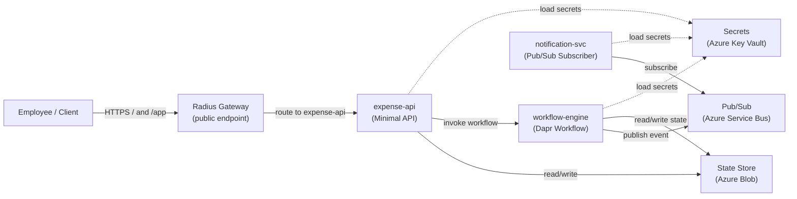

# RadiusClaim

> A reference sample for building portable distributed systems with **Dapr** (app layer) and **Radius** (infrastructure/environment layer), **deployed on Kubernetes with Azure backing services**.

---

> **Note:** This is sample code for learning and reference. It is not production-ready. Use it to understand patterns; adapt it for your production requirements, security posture, and testing standards.

---

## The Problem

Teams building distributed apps face two hard questions:

1. **How do I write app code once** but run it anywhere — local dev, staging, production — without rewriting for each platform?
2. **How do I define connections** (state stores, message buses, secrets) **cleanly**, without littering my app code or wrestling with raw Kubernetes YAML?

RadiusClaim shows the answer: **Dapr keeps app code portable; Radius declares what the app connects to and where services run.**

---

## The Architecture Story

### The Application Flow

An employee submits an expense. A workflow validates, approves or rejects, processes reimbursement, and notifies the employee — all orchestrated through loosely coupled services.

```
Employee
   │
   ├─> expense-api: POST /expenses
   │          │
   │          └─> [State] submit expense, invoke workflow-engine
   │
   ├─> workflow-engine: Dapr Workflow orchestrator
   │          │
   │          ├─> Activity: ValidateExpense
   │          ├─> Activity: ApproveExpense (auto-approve when amount is < $100.00)
   │          ├─> Activity: ProcessReimbursement
   │          └─> Publish: ExpenseApproved or ExpenseRejected to pub/sub
   │
   └─> notification-svc: Pub/Sub subscriber
              │
              └─> Log or send notification (email/Slack/console)
```

### The Service Boundaries

| Service | Responsibility | Dapr Building Blocks |
|---------|---------------|---------------------|
| **expense-api** | Accept submissions, expose query endpoints | Service Invocation, State |
| **workflow-engine** | Orchestrate the approval flow | Workflows, Pub/Sub (publisher) |
| **notification-svc** | Consume approval events, send notifications | Pub/Sub (subscriber) |

### Demo web UI

The sample now includes a lightweight web UI hosted by `expense-api` at **`/app`**.

- Submit expenses without leaving the browser
- Watch recent expense history update live
- Inspect workflow telemetry and correlation IDs without adding a separate frontend deployment surface
- Reach it through the Radius-managed public gateway on the Kubernetes deployment path

This keeps the demo teachable: no extra Node-based toolchain, no CORS setup, and no new platform story to explain before the core Radius + Dapr narrative lands.

> `/app` can load before the full backend is ready. For local runs, start `expense-api` with its Dapr sidecar and the configured `statestore`; workflow telemetry also needs `workflow-engine` reachable through Dapr. A plain `dotnet run` only brings up the ASP.NET shell.

### Dapr's Role: Portability

The **app code** uses Dapr abstractions:

- **State Store**: expenses and workflow checkpoints are persisted via Dapr, not SQL
- **Workflows**: distributed saga pattern via Dapr Workflow SDK
- **Pub/Sub**: loose coupling between workflow and notifications
- **Service Invocation**: expense-api talks to workflow-engine via Dapr, not raw HTTP

All of this is **cloud-agnostic**. The same `.NET` code runs:

- Locally with Redis (dev)
- On Kubernetes with any Dapr backing services (e.g., AKS with Azure Blob + Service Bus)
- On any Kubernetes cluster with pluggable components

### Radius's Role: Infrastructure Clarity

The **platform engineer** uses Radius to:

- Define **what services exist** (`expense-api`, `workflow-engine`, `notification-svc`)
- Wire **what they connect to** (state store, pub/sub, secrets) via links
- Choose **where they run** without rewriting the app model
- Separate **environment concerns** (`dev.bicep`, `azure-radius.bicep`)

Radius generates the Kubernetes manifests and Dapr component specs — no hand-written YAML.

### Deployment Story: Kubernetes-First with Portable Backing Services

**This sample is deployable on any Kubernetes cluster with Dapr and Radius.** The primary example uses **Azure Kubernetes Service (AKS)** with Azure-managed backing services.

**Primary deployment path** (`.github/workflows/deploy-azure.yml`, `deploy-kubernetes` job):
- Builds and publishes images, then runs `rad deploy` against `infra/radius/environments/azure-radius.bicep` and `infra/radius/app.bicep`
- Publishes the repo's custom Radius recipes as OCI artifacts before environment deployment, because Radius recipe `templatePath` values must resolve to registry-backed artifacts rather than local file paths
- Keeps service topology, Dapr component names, and resource wiring in Radius
- Deploys to a Kubernetes cluster (AKS in the Azure example, or any K8s cluster with Radius control plane)
- Exposes only `expense-api` publicly through an `Applications.Core/gateways@2023-10-01-preview` resource; `workflow-engine` and `notification-svc` stay internal
- Lets Radius print the public endpoint at deploy time, so humans can open `/app` without falling back to port-forward unless the cluster lacks an external address
- Azure-specific backing services (Blob Storage, Service Bus, Key Vault) are provisioned by Radius recipes for the Azure environment

**Stock Radius 0.55 alignment:** This repo keeps the deployable application surface on `Applications.Core/applications@2023-10-01-preview`, `Applications.Core/environments@2023-10-01-preview`, `Applications.Core/containers@2023-10-01-preview`, and `Applications.Core/gateways@2023-10-01-preview`, while the Dapr building blocks remain on [`Applications.Dapr/stateStores@2023-10-01-preview`](https://docs.radapp.io/reference/resource-schema/dapr-schema/statestore), [`Applications.Dapr/pubSubBrokers@2023-10-01-preview`](https://docs.radapp.io/reference/resource-schema/dapr-schema/pubsub/), and [`Applications.Dapr/secretStores@2023-10-01-preview`](https://docs.radapp.io/reference/resource-schema/dapr-schema/secretstore). That matches the first-party 0.55 docs and avoids the live `InvalidResourceNamespace` failure reported for `Radius.Compute/containers`. If you later target a custom preview catalog, the exact compute/ingress pivot is `Applications.Core/containers` → `Radius.Compute/containers` and `Applications.Core/gateways` → `Radius.Compute/routes`, plus the accompanying schema move from `properties.container` to a `properties.containers` map and from an `extensions[]` array to `extensions.daprSidecar`.

**Idempotent deployment:** The GitHub Actions workflow creates or switches to the target environment name (`azure`) directly rather than using temporary bootstrap environments. This ensures deployments are repeatable: `rad deploy` on the environment Bicep updates the environment configuration in place, and subsequent application deployments work against a stable, well-known environment identity. Manual deployments follow the same pattern: `rad env create <name> || true` then `rad env switch <name>` before deploying the environment Bicep.

**Operator fast path:** Treat cluster prep and app deployment as two separate phases.

```bash
# First time on a cluster
./scripts/prepare-cluster.sh \
  --resource-group radiusclaim-rg \
  --aks-cluster-name radiusclaim-aks \
  --create-aks \
  --install-dapr \
  --install-radius \
  --yes

./scripts/bootstrap.sh --resource-group radiusclaim-rg --yes

# Later deployments on the same prepared cluster
./scripts/bootstrap.sh --resource-group radiusclaim-rg --yes
```

**Dapr component backfill (required after first deployment):** Radius may report `Applications.Dapr/*` resources as Succeeded without projecting `components.dapr.io` CRDs into Kubernetes. After `rad deploy infra/radius/app.bicep`, verify components exist in the workload namespace (`kubectl get components.dapr.io -n radiusclaim-azure-radiusclaim`). If missing, run `./scripts/deploy-dapr-components.sh --resource-group <rg> --namespace radiusclaim-azure-radiusclaim` to backfill. See the [end-to-end walkthrough](./docs/end-to-end-setup-walkthrough.md) Step 9a for details.

**Azure credential registration (required):** Before deploying the Radius environment with Azure-backed recipes, register the Azure credential with the Radius control plane using an explicit auth mode such as `rad credential register azure sp --client-id "$AZURE_CLIENT_ID" --client-secret "$AZURE_CLIENT_SECRET" --tenant-id "$AZURE_TENANT_ID"` (or `rad credential register azure wi ...` when workload identity is configured). This step is critical — without it, recipe deployment fails with a missing `azure-azurecloud-default` secret error. The GitHub Actions workflow includes the service principal form automatically; manual deployments must run an explicit `sp` or `wi` registration. See [`docs/radius-validation-checklist.md`](./docs/radius-validation-checklist.md) for details.

**Supported deployment targets**:
- **AKS (Azure Kubernetes Service)** — the primary example, with Azure backing services
- **Arc-enabled Kubernetes** — on-premises or multi-cloud Kubernetes with Radius and Azure recipes
- **Self-managed Kubernetes clusters** — any K8s cluster with Dapr and Radius control plane; Azure backing services require Azure subscription

**Portability scope**:
1. **Application code is fully portable** — uses Dapr abstractions (state, pub/sub, service invocation, workflows)
2. **Deployment model is portable** — Radius app model and environment patterns are cloud-agnostic
3. **Azure backing services are Azure-specific** — Blob Storage, Service Bus, Key Vault recipes require Azure
4. When Radius recipes for other clouds are added, the same app model can target those platforms with only environment/recipe changes

**Legacy ACA reference only:**
The old ACA fallback path has been removed from the GitHub Actions workflow. `infra/radius/environments/azure.bicep` remains only as a legacy Azure Container Apps reference; the active workflow is Kubernetes-first. Teams requiring container-only Azure deployment should use Azure Container Instances or Azure Container Apps directly outside this sample.

---

## Architecture Diagram (Mermaid)



---

## Project Layout

```
RadiusClaim/
├── src/
│   ├── RadiusClaim.Contracts/           # Shared DTOs and events
│   ├── expense-api/                      # Minimal API for submission + hosted web UI
│   ├── workflow-engine/                  # Dapr Workflow orchestrator
│   └── notification-svc/                 # Pub/Sub subscriber
├── infra/
│   ├── radius/
│   │   ├── app.bicep                     # Radius application model
│   │   ├── environments/
│   │   │   ├── dev.bicep                 # Local Radius environment
│   │   │   └── azure-radius.bicep        # Kubernetes + Radius Azure-backed environment
│   │   └── recipes/azure/                # Azure backing-resource recipes
│   └── dapr/local/                       # Local-only Dapr component overlays
├── scripts/
│   ├── prepare-cluster.sh                # First-time AKS/Kubernetes cluster preparation
│   ├── bootstrap.sh                      # Repeatable env + app deployment on a prepared cluster
│   ├── deploy-dapr-components.sh          # Dapr component backfill after Radius deploy
│   ├── publish-radius-recipes.sh          # OCI recipe publishing
│   └── validate-deployment.sh             # End-to-end flow validation
├── RadiusClaim.slnx
└── README.md
```

---

## Shared Contracts

All services use these types from `RadiusClaim.Contracts`. No Dapr dependencies in contracts — pure data shapes.

### Demo flow contract rules

- `ExpenseId` is the stable business identifier for the expense record.
- `CorrelationId` is created at submission time and reused across workflow and notification messages; in later phases it can double as the workflow instance id.
- Timestamp fields are explicitly named with `Utc` so the demo does not imply local-time behavior.
- `ExpenseRejected` is reserved for a terminal denial with a required human-readable reason.
- `NotificationRequest.EventType` keeps notification semantics explicit and leaves room for a future `ManualReviewRequested` branch without overloading rejection.

### Current contract shapes

```csharp
public sealed record ExpenseSubmission(
    string ExpenseId,
    string CorrelationId,
    string EmployeeId,
    decimal Amount,
    string Currency,
    string Description,
    DateTimeOffset SubmittedAtUtc
);

public sealed record ExpenseApproved(
    string ExpenseId,
    string CorrelationId,
    string EmployeeId,
    decimal ApprovedAmount,
    string Currency,
    string DecisionSource,
    DateTimeOffset ApprovedAtUtc
);

public sealed record ExpenseRejected(
    string ExpenseId,
    string CorrelationId,
    string EmployeeId,
    decimal Amount,
    string Currency,
    string DecisionSource,
    string Reason,
    DateTimeOffset RejectedAtUtc
);

public enum NotificationEventType
{
    ExpenseApproved,
    ExpenseRejected,
    ManualReviewRequested
}

public sealed record NotificationRequest(
    string ExpenseId,
    string CorrelationId,
    string Recipient,
    string Channel,
    NotificationEventType EventType,
    string Subject,
    string Message,
    DateTimeOffset OccurredAtUtc
);
```

### Threshold rule for the sample

- **Invalid input:** amounts less than or equal to `0` are validation failures, not approval outcomes.
- **Auto-approval:** an amount strictly below **`$100.00`** is eligible for automatic approval.
- **Boundary decision:** **`$100.00` exactly is _not_ auto-approved.**
- **Future manual-review path:** amounts at or above **`$100.00`** will later produce a distinct `ManualReviewRequested` event/notification path. That path is intentionally **not** represented as `ExpenseRejected`, because “needs a human decision” is not the same thing as “denied.”

---

## Why This Architecture?

### Simplicity for a Ten-Minute Demo

- **Three services** = enough to show service invocation, workflows, pub/sub, and state
- **One workflow** = concrete orchestration pattern, not abstract theory
- **Shared contracts** = no coupling on schema, only on types
- **No authentication, audit logging, or multi-tier approval** = focus on the core pattern

### Enterprise-Ready Story

- **Portability**: App code is Dapr-native but not cloud-specific; same code runs anywhere
- **Clarity**: Dapr is the "app language" (state, workflows, pub/sub); Radius is the "platform language" (services, links, environments)
- **Testability**: Contracts are plain C#; services are standalone; integration tests work locally with Dapr emulators

### Application Portability vs. Infrastructure Reality

**Application code is cloud-agnostic:**

| Concern | Dev (Local) | Production (Any Dapr Platform) |
|---------|-------------|--------------------------------|
| Compute | Docker Dapr sidecar | Any container runtime with Dapr |
| State Store | Redis (via Dapr) | Any Dapr state component |
| Pub/Sub | Redis (via Dapr) | Any Dapr pub/sub component |
| Secrets | Local file (via Dapr) | Any Dapr secret store |

**Current infrastructure path is Kubernetes-first with Azure backing services:**

The provided GitHub Actions workflow deploys to Kubernetes (AKS as the primary example) with Dapr and Radius. The app code remains portable. When Radius recipes for other clouds are available, the same app model can target those platforms. Azure backing services (Blob Storage, Service Bus, Key Vault) are Azure-specific because Radius recipes define them that way — other recipe implementations can substitute equivalent services on other clouds or use self-managed options.

---

## Deployment: Kubernetes-First with Azure Example

The GitHub Actions workflow (`.github/workflows/deploy-azure.yml`) deploys to Kubernetes (AKS as the primary example) via Radius.

### Required Repository Secrets

| Secret | Purpose | Required |
|--------|---------|----------|
| `AZURE_SUBSCRIPTION_ID` | Azure subscription ID for Azure backing services (state, pub/sub, secrets recipes) | ✅ Yes |
| `AZURE_CLIENT_ID` | Azure service principal client ID used when registering Radius Azure credentials in CI | ✅ Yes |
| `AZURE_CLIENT_SECRET` | Azure service principal client secret used when registering Radius Azure credentials in CI | ✅ Yes |
| `AZURE_TENANT_ID` | Azure tenant ID used when registering Radius Azure credentials in CI | ✅ Yes |
| `RADIUS_KUBECONFIG` | Raw kubeconfig content for the Kubernetes cluster that hosts Radius and the app workloads | ✅ Yes |

### Required Repository Variables

| Variable | Purpose | Example |
|----------|---------|---------|
| `AZURE_LOCATION` | Azure region for backing services (Blob, Service Bus, Key Vault) | `eastus`, `westus2` |
| `AZURE_RESOURCE_GROUP` | Resource group name for Azure backing services | `radiusclaim-rg` |
| `RADIUS_KUBERNETES_CONTEXT` | kubectl context name (optional, uses current context if unset) | `my-aks-context` |
| `RADIUS_KUBERNETES_NAMESPACE` | Target Kubernetes namespace (optional, defaults to `radiusclaim-azure`) | `radiusclaim-azure` |

**To configure secrets and variables:**
1. Navigate to your repository **Settings** → **Secrets and variables** → **Actions**
2. Add secrets under the **Secrets** tab
3. Add variables under the **Variables** tab
4. Start with the [end-to-end setup walkthrough](./docs/end-to-end-setup-walkthrough.md) for the full operator flow, then use the [Kubernetes + Radius validation checklist](./docs/radius-validation-checklist.md) for preflight checks and troubleshooting

**Create the service principal (one-time):**

Scope it to the target resource group instead of the whole subscription.

```bash
export AZURE_RESOURCE_GROUP="radiusclaim-rg"
export AZURE_SUBSCRIPTION_ID="$(az account show --query id -o tsv)"

az ad sp create-for-rbac \
  --name "radiusclaim-github-actions" \
  --role Contributor \
  --scopes "/subscriptions/$AZURE_SUBSCRIPTION_ID/resourceGroups/$AZURE_RESOURCE_GROUP" \
  --query '{clientId:appId,clientSecret:password,tenantId:tenant}' \
  -o jsonc
```

Store the returned `clientId`, `clientSecret`, and `tenantId` as GitHub secrets named `AZURE_CLIENT_ID`, `AZURE_CLIENT_SECRET`, and `AZURE_TENANT_ID`, and store `AZURE_SUBSCRIPTION_ID` as a GitHub secret too.

### Deployment Path: Kubernetes + Radius

- First-time cluster prep lives in `scripts/prepare-cluster.sh` (AKS reuse/create, `kubectl` context, Dapr, Radius, Radius workspace/group)
- Builds service images and pushes to GHCR (GitHub Container Registry)
- Manual `rad deploy` runs must pass a real published image tag; the stale `phase1` fallback was removed so the app model stops pointing at retired GHCR packages
- `scripts/bootstrap.sh` handles the repeatable deployment layer: Radius environment (`azure-radius.bicep`), application (`app.bicep`), Dapr component backfill, and validation
- Azure backing resources (Blob Storage, Service Bus, Key Vault) are created by Radius recipes
- Publishes `expense-api` through a Radius-managed public gateway while keeping the worker services internal
- Uses the shared end-to-end validation script; CI still uses a Kubernetes port-forward as deterministic fallback while the public endpoint propagates
- **Requires:** `RADIUS_KUBECONFIG` secret, Kubernetes cluster with Dapr and Radius control plane

**Supported targets:**
- Azure Kubernetes Service (AKS) with Azure backing services (primary example)
- Arc-enabled Kubernetes clusters with Radius and Azure recipes
- Self-managed Kubernetes + Radius with Azure recipes
- Self-managed Kubernetes + Radius with custom recipes (backings remain local or cloud-specific based on recipe choice)

---

## Quick Start (Local Dev)

> Coming in Phase 2. For now, see individual service READMEs.

---

## What's Next

**Completed:**
1. ✅ **Phase 1–4**: App code complete (Dapr workflows, pub/sub, state, service invocation)
2. ✅ **Phase 5**: Radius models and local validation
3. ✅ **Phase 6**: GitHub Actions CI/CD, Kubernetes-first deployment path, and end-to-end validation

**In Progress:**
7. **Phase 7**: Final documentation, extended demo walkthrough, and integration test harness

**Future Enhancements (Out of Scope):**
- Radius recipes for other clouds — would enable same app model on other platforms
- Multi-environment promotion (dev → staging → prod)
- Real notification output bindings (email, Slack, Teams)
- Integration test suite
- Secret rotation patterns

---

## Additional Documentation

- **[End-to-End Setup Walkthrough](./docs/end-to-end-setup-walkthrough.md)** — Complete operator guide from Azure login and resource group creation through opening the app in a browser, including setup automation vs. manual steps
- **[Phase 7 Demo Walkthrough](./docs/phase-7-demo-walkthrough.md)** — Step-by-step guide for running the $50 and $150 expense flows
- **[Kubernetes + Radius Validation Checklist](./docs/radius-validation-checklist.md)** — Pre-deployment validation and troubleshooting for Kubernetes + Radius deployment
- **[ADR-0001: Kubernetes-First Deployment Strategy](./docs/ADR-0001-kubernetes-first-deployment.md)** — Architectural decision record explaining the Kubernetes + Radius primary path and portability scope

---

## Links

- [Dapr Docs](https://docs.dapr.io)
- [Radius Docs](https://docs.radapp.io)
- [Azure Kubernetes Service](https://learn.microsoft.com/en-us/azure/aks)

---

**Status:** Phase 7 In Progress (Phases 1–6 complete; app portable via Dapr, Kubernetes-first deployment via Radius, Azure backing services, validation documentation complete)  
**Target:** Dapr-portable app code; Kubernetes + Radius declarative deployment; Azure backing services (other clouds supported via recipes)  
**Demo Runtime:** ~10 minutes (proof: auto-approve flow at < $100, manual review at ≥ $100, end-to-end pub/sub notification)
