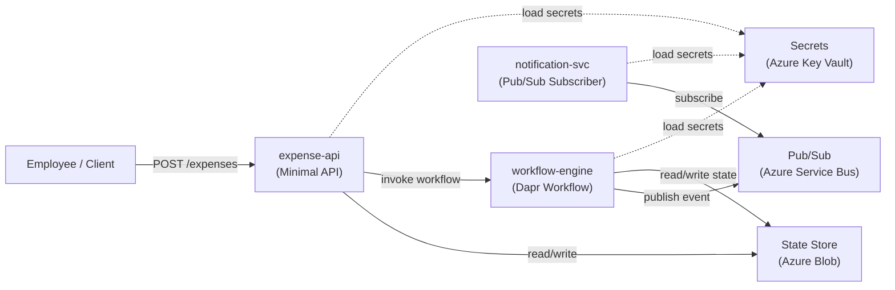

# CloudExpense Lite

> A reference sample for building portable distributed systems with **Dapr** (app layer) and **Radius** (infrastructure/environment layer), **deployed on Azure Container Apps**.

---

## The Problem

Teams building distributed apps face two hard questions:

1. **How do I write app code once** but run it anywhere — local dev, staging, production — without rewriting for each platform?
2. **How do I define connections** (state stores, message buses, secrets) **cleanly**, without littering my app code or wrestling with raw Kubernetes YAML?

CloudExpense Lite shows the answer: **Dapr keeps app code portable; Radius declares what the app connects to and where services run.**

---

## The Architecture Story

### The Application Flow

An employee submits an expense. A workflow validates, approves or rejects, processes reimbursement, and notifies the employee — all orchestrated through loosely coupled services.

```
Employee
   │
   ├─> expense-api: POST /expenses
   │          │
   │          └─> [State] submit expense, invoke workflow-engine
   │
   ├─> workflow-engine: Dapr Workflow orchestrator
   │          │
   │          ├─> Activity: ValidateExpense
   │          ├─> Activity: ApproveExpense (auto-approve when amount is < $100.00)
   │          ├─> Activity: ProcessReimbursement
   │          └─> Publish: ExpenseApproved or ExpenseRejected to pub/sub
   │
   └─> notification-svc: Pub/Sub subscriber
              │
              └─> Log or send notification (email/Slack/console)
```

### The Service Boundaries

| Service | Responsibility | Dapr Building Blocks |
|---------|---------------|---------------------|
| **expense-api** | Accept submissions, expose query endpoints | Service Invocation, State |
| **workflow-engine** | Orchestrate the approval flow | Workflows, Pub/Sub (publisher) |
| **notification-svc** | Consume approval events, send notifications | Pub/Sub (subscriber) |

### Dapr's Role: Portability

The **app code** uses Dapr abstractions:

- **State Store**: expenses and workflow checkpoints are persisted via Dapr, not SQL
- **Workflows**: distributed saga pattern via Dapr Workflow SDK
- **Pub/Sub**: loose coupling between workflow and notifications
- **Service Invocation**: expense-api talks to workflow-engine via Dapr, not raw HTTP

All of this is **cloud-agnostic**. The same `.NET` code runs:

- Locally with Redis (dev)
- On Azure Container Apps with Service Bus and Blob Storage (prod)
- On any Kubernetes cluster with pluggable components

### Radius's Role: Infrastructure Clarity

The **platform engineer** uses Radius to:

- Define **what services exist** (`expense-api`, `workflow-engine`, `notification-svc`)
- Wire **what they connect to** (state store, pub/sub, secrets) via links
- Choose **where they run** (Azure Container Apps, AKS, local Docker)
- Separate **environment concerns** (`dev.bicep`, `prod.bicep`)

Radius generates the Kubernetes manifests and Dapr component specs — no hand-written YAML.

### Deployment Story: Portable App, Azure-First Example

**This sample is deployable on Azure today.** The application code is portable; the current infrastructure path is not.

**Current deployment** (`.github/workflows/deploy-azure.yml`):
- Uses Azure CLI (`az deployment group`, `az containerapp`) directly, bypassing Radius
- Provisions Azure Container Apps, Blob Storage, Service Bus, and Key Vault explicitly
- Is a **workaround** — allows us to deploy and validate while Radius ACA support is in development

**Intended portable story**:
1. App code uses Dapr abstractions (app layer)
2. Radius declares service topology and backing resources (platform layer)
3. `rad deploy` handles environment wiring — no Azure-specific CLI steps

For now, **Azure is the deployment example**. The Dapr-based application code is ready to run on any Dapr-enabled platform (local, Kubernetes, other clouds) without code changes. The Radius models exist but the GitHub Actions workflow takes the Azure-direct path for availability.

---

## Architecture Diagram (Mermaid)



---

## Project Layout

```
sovereignapp/
├── src/
│   ├── CloudExpense.Contracts/           # Shared DTOs and events
│   │   └── CloudExpense.Contracts.csproj
│   ├── CloudExpense.ExpenseApi/          # Minimal API for submission
│   │   └── CloudExpense.ExpenseApi.csproj
│   ├── CloudExpense.WorkflowEngine/      # Dapr Workflow orchestrator
│   │   └── CloudExpense.WorkflowEngine.csproj
│   └── CloudExpense.NotificationSvc/     # Pub/Sub subscriber
│       └── CloudExpense.NotificationSvc.csproj
├── infra/
│   ├── app.bicep                         # Radius application model
│   ├── environments/
│   │   ├── dev.bicep                     # Local/emulator environment
│   │   └── prod.bicep                    # Azure environment
│   └── dapr/
│       ├── statestore.yaml               # Dapr state store component
│       ├── pubsub.yaml                   # Dapr pub/sub component
│       └── secrets.yaml                  # Dapr secrets component
├── CloudExpense.sln
└── README.md
```

---

## Shared Contracts

All services use these types from `CloudExpense.Contracts`. No Dapr dependencies in contracts — pure data shapes.

### Demo flow contract rules

- `ExpenseId` is the stable business identifier for the expense record.
- `CorrelationId` is created at submission time and reused across workflow and notification messages; in later phases it can double as the workflow instance id.
- Timestamp fields are explicitly named with `Utc` so the demo does not imply local-time behavior.
- `ExpenseRejected` is reserved for a terminal denial with a required human-readable reason.
- `NotificationRequest.EventType` keeps notification semantics explicit and leaves room for a future `ManualReviewRequested` branch without overloading rejection.

### Current contract shapes

```csharp
public sealed record ExpenseSubmission(
    string ExpenseId,
    string CorrelationId,
    string EmployeeId,
    decimal Amount,
    string Currency,
    string Description,
    DateTimeOffset SubmittedAtUtc
);

public sealed record ExpenseApproved(
    string ExpenseId,
    string CorrelationId,
    string EmployeeId,
    decimal ApprovedAmount,
    string Currency,
    string DecisionSource,
    DateTimeOffset ApprovedAtUtc
);

public sealed record ExpenseRejected(
    string ExpenseId,
    string CorrelationId,
    string EmployeeId,
    decimal Amount,
    string Currency,
    string DecisionSource,
    string Reason,
    DateTimeOffset RejectedAtUtc
);

public enum NotificationEventType
{
    ExpenseApproved,
    ExpenseRejected,
    ManualReviewRequested
}

public sealed record NotificationRequest(
    string ExpenseId,
    string CorrelationId,
    string Recipient,
    string Channel,
    NotificationEventType EventType,
    string Subject,
    string Message,
    DateTimeOffset OccurredAtUtc
);
```

### Threshold rule for the sample

- **Invalid input:** amounts less than or equal to `0` are validation failures, not approval outcomes.
- **Auto-approval:** an amount strictly below **`$100.00`** is eligible for automatic approval.
- **Boundary decision:** **`$100.00` exactly is _not_ auto-approved.**
- **Future manual-review path:** amounts at or above **`$100.00`** will later produce a distinct `ManualReviewRequested` event/notification path. That path is intentionally **not** represented as `ExpenseRejected`, because “needs a human decision” is not the same thing as “denied.”

---

## Why This Architecture?

### Simplicity for a Ten-Minute Demo

- **Three services** = enough to show service invocation, workflows, pub/sub, and state
- **One workflow** = concrete orchestration pattern, not abstract theory
- **Shared contracts** = no coupling on schema, only on types
- **No authentication, audit logging, or multi-tier approval** = focus on the core pattern

### Enterprise-Ready Story

- **Portability**: App code is Dapr-native but not cloud-specific; same code runs anywhere
- **Clarity**: Dapr is the "app language" (state, workflows, pub/sub); Radius is the "platform language" (services, links, environments)
- **Testability**: Contracts are plain C#; services are standalone; integration tests work locally with Dapr emulators

### Application Portability vs. Infrastructure Reality

**Application code is cloud-agnostic:**

| Concern | Dev (Local) | Production (Any Dapr Platform) |
|---------|-------------|--------------------------------|
| Compute | Docker Dapr sidecar | Any container runtime with Dapr |
| State Store | Redis (via Dapr) | Any Dapr state component |
| Pub/Sub | Redis (via Dapr) | Any Dapr pub/sub component |
| Secrets | Local file (via Dapr) | Any Dapr secret store |

**Current infrastructure is Azure-specific:**

The provided GitHub Actions workflow deploys to Azure Container Apps with Azure's backing services (Blob Storage, Service Bus, Key Vault). This works today but requires Azure-specific infrastructure code. When Radius support for Azure Container Apps matures, the deployment will shift to a cloud-agnostic `rad deploy` path while keeping the app code unchanged.

---

## Quick Start (Local Dev)

> Coming in Phase 2. For now, see individual service READMEs.

---

## What's Next

**Completed:**
1. ✅ **Phase 1–4**: App code complete (Dapr workflows, pub/sub, state, service invocation)
2. ✅ **Phase 5**: Radius models and local validation
3. ✅ **Phase 6**: GitHub Actions CI/CD and end-to-end Azure validation

**In Progress:**
7. **Phase 7**: Final documentation, extended demo walkthrough, and integration test harness

**Future Enhancements (Out of Scope):**
- Radius ACA support (will make CI/CD `rad deploy` instead of `az` CLI)
- Multi-environment promotion (dev → staging → prod)
- Real notification output bindings (email, Slack, Teams)
- Integration test suite
- Secret rotation patterns

---

## Links

- [Dapr Docs](https://docs.dapr.io)
- [Radius Docs](https://docs.radapp.io)
- [Azure Container Apps](https://learn.microsoft.com/en-us/azure/container-apps)

---

**Status:** Phase 6 Complete (Phases 1–6 done; app portable, Azure-first deployment working)  
**Target:** Dapr-portable app code; Azure Container Apps deployment (current); Radius-declarative wiring (intended for future)  
**Demo Runtime:** ~10 minutes (proof: auto-approve flow at < $100, manual review at ≥ $100, end-to-end pub/sub notification)
